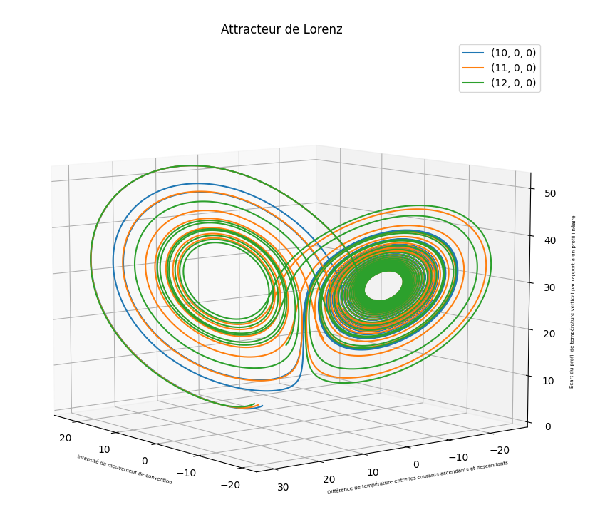
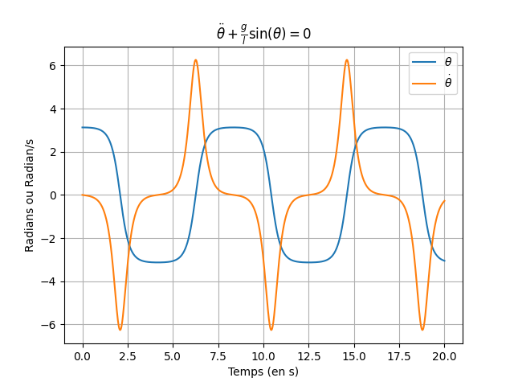
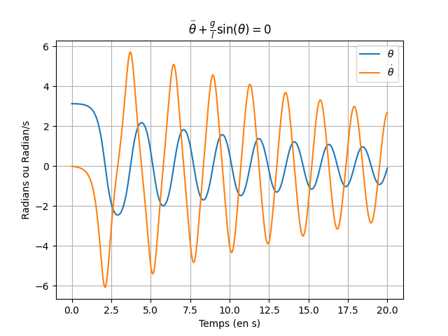
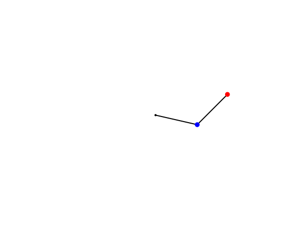
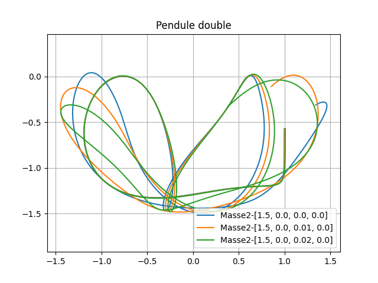
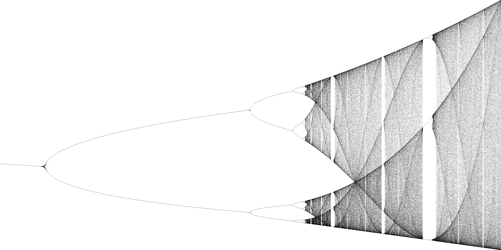

# Equation différentielles

Ce projet contient quelques fameux problèmes de physiques ne pouvant se résoudre à la main comme le pendule simple. 
Il explore également les systèmes chaotiques comme le double pendule ou l'attracteur de Lorenz en passant par la suite logistique.

## L'attracteur de Lorenz

$$\left\{\displaystyle{
    \begin{aligned}
        {\frac {\mathrm {d} x}{\mathrm {d} t}}&=\sigma (y-x),\\[6pt]
        {\frac {\mathrm {d} y}{\mathrm {d} t}}&=x(\rho -z)-y\\[6pt]
        {\frac {\mathrm {d} z}{\mathrm {d} t}}&=xy-\beta z
    \end{aligned}
}
\right.
$$

## Le pendule simple (avec ou sans frottements)

$$\ddot{\theta} + \frac{\alpha}{ml}\dot{\theta}+\frac{g}{l}\sin(\theta)=0$$

## Le pendule double 

https://fr.wikipedia.org/wiki/Pendule_double

$$\displaystyle{
    \begin{cases}
    l_{1}{\ddot {\theta }}_{1}\cos(\theta _{1}-\theta _{2})+l_{2}{\ddot {\theta }}_{2}-l_{1}{\dot {\theta }}_{1}^{2}\sin(\theta _{1}-\theta _{2})+g\sin(\theta _{2})=0\\
    (m_{1}+m_{2})l_{1}{\ddot {\theta }}_{1}+m_{2}l_{2}{\ddot {\theta }}_{2}\cos(\theta _{1}-\theta _{2})+m_{2}l_{2}{\dot {\theta }}_{2}^{2}\sin(\theta _{1}-\theta _{2})+(m_{1}+m_{2})g\sin(\theta _{1})=0
    \end{cases}}
$$

Pour aller plus loin sur les pendules:
https://jakevdp.github.io/blog/2017/03/08/triple-pendulum-chaos/

# La suite logistique

https://fr.wikipedia.org/wiki/Suite_logistique

$$
\begin{cases} 
    x_{n+1} & = \mu \, x_n \, (1-x_n) \\ 
    x_0 &\in [0,1]
\end{cases}
$$

# Henon's map

https://en.wikipedia.org/wiki/H%C3%A9non_map

$$
\begin{cases} 
    x_{n+1} & = 1+y_n-ax_n^2 \\ 
    y_{n+1} &=  bx_n
\end{cases}
$$

Ce qui revien pour x à
$$x_{n+2}=1+bx_n-ax_{n+1}^2$$

# Chirikov Standard map

http://www.scholarpedia.org/article/Chirikov_standard_map
https://en.wikipedia.org/wiki/Standard_map

## Autres projets 
https://sprott.physics.wisc.edu/chaos/comchaos.htm

# Theory

https://en.wikipedia.org/wiki/Kaplan%E2%80%93Yorke_conjecture
https://fr.wikipedia.org/wiki/Exposant_de_Liapounov